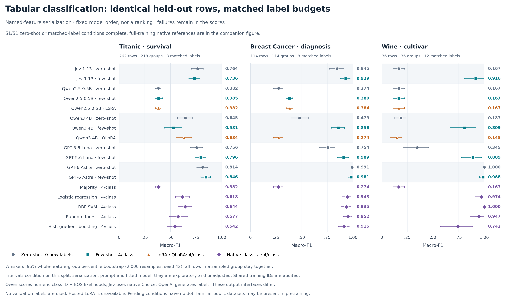
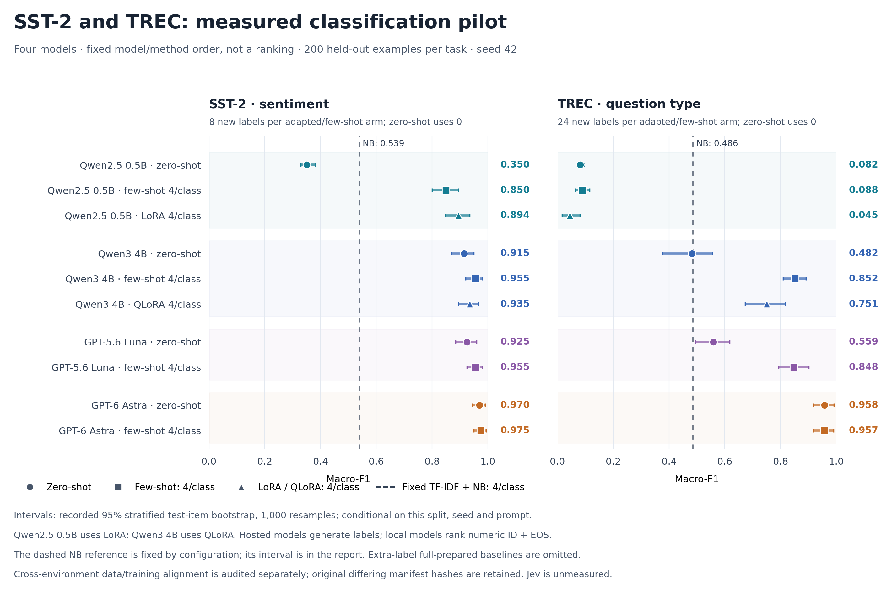

# Jev classification benchmark

A reproducible study of **numerical tabular classification**: six language models, Jev as a bounded decision reviewer, Jev alone, and native classical machine learning. A separate text extension applies the same source → Jev review pipeline to SST-2 and TREC. Earlier broad text/tabular and LoRA experiments remain archived below.

## Current question: bounded decisions on numerical data

The focused study asks: **how does Jev perform against XGBoost and LightGBM on numerical tabular classification, and does adding Jev as a reviewer improve an LLM's proposed class?** Start with the [conclusions](results/numeric_expansion/INTERPRETATION.md), [LinkedIn draft](results/numeric_expansion/LINKEDIN_DRAFT.md), [expanded numeric-only findings](results/numeric_expansion/FINDINGS.md), [experimental protocol](docs/EXPANDED_NUMERIC_PROTOCOL.md), [machine-readable comparisons](results/numeric_expansion/COMPARISON.json), and [Colab reproduction guide](docs/EXPANDED_NUMERIC_REPRODUCTION.md).

**Current status: 61/68 conditions complete.** Every source-model run is finished (24/24), including the eight new SmolLM2/Granite conditions. Jev review is complete for 17/24 conditions; seven remain unfinished after a provider billing halt. The paused run keeps six HTTP 402 failures and continues with unseen rows only after funding is restored. Pending scores are unavailable. See [execution status](results/numeric_expansion/STATUS.md).

The expanded numerical study covers **Qwen2.5 0.5B, SmolLM2 1.7B, Granite 3.3 2B, Qwen3 4B, GPT-5.6 Luna and GPT-6 Astra**, each at **zero-shot and four examples per class**, alone and followed by Jev review. Jev alone and native XGBoost, LightGBM, logistic regression and random forest provide references. Breast Cancer uses 114 held-out rows and Wine uses 36; few-shot supplies eight and twelve training labels respectively. Both pipeline stages receive the same examples. Full-training ML uses additional labels and is reported separately.

The earlier broad work below compared separate models across text and tabular tasks. The numerical study excludes text and Titanic and tests cached proposed classes followed by Jev review, without generating new rationales. This is an exploratory two-dataset pilot, not a general claim that bounded answers are correct or that Jev improves every LLM. The [first four review runs and their conclusions](results/numeric_decisions/INTERPRETATION.md) remain preserved; their measured predictions are reused in the expansion. No new LoRA training is added by this expansion.

```bash
python -m pip install -e '.[dev,numeric,neural]' 'transformers==4.57.6'
python scripts/tabular_data.py --datasets breast_cancer wine --output data/tabular-full
python scripts/run_numeric_boosting.py
python scripts/run_expanded_numeric_local.py --device cuda
python scripts/run_expanded_numeric_review.py
python scripts/summarize_expanded_numeric.py
```

The model commands above only plan. For actual public-weight inference, follow the Colab guide; for Jev calls use `--execute` with the existing credential mechanism. The review runner requires frozen data and source predictions, reuses completed conditions, and enforces the expanded **US$25 cumulative ceiling** with one new US$5 ledger anchored to all earlier ledgers. Never initialize a replacement ledger when resuming. See the [budget guide](docs/BUDGET.md).

## Text extension: the same pipeline on SST-2 and TREC

The [text protocol](docs/TEXT_EXTENSION_PROTOCOL.md) extends the bounded-decision comparison to the original **200 SST-2 and 200 TREC test rows**. The same six source models run at zero-shot and four labeled examples per class, alone and followed by Jev. The reviewer receives the original text, the same examples and the cached proposed class ID; it receives no source rationale, confidence vector or hidden test label. Four direct-Jev references and sixteen new XGBoost, LightGBM, logistic-regression and random-forest conditions complete a separate **68-condition matrix**.

**Starting status: 36/68 conditions complete.** Sixteen historical source runs, four direct-Jev references and sixteen new classical runs are audited. Eight SmolLM2/Granite source conditions and all twenty-four reviews remain pending; no text-review calls have started. Read the [audited findings](results/text_extension/FINDINGS.md), [comparison data](results/text_extension/COMPARISON.json) and [reproduction guide](docs/TEXT_EXTENSION_REPRODUCTION.md) for the latest evidence. Pending scores are unavailable, and this status provides no finding about Jev review performance.

Classical models share train-only word/character TF-IDF. Matched training supplies eight SST-2 or twenty-four TREC labels; separate full-training references use 10,000 or 4,886 labels. No validation labels or hyperparameter search are used in this extension. XGBoost treats unstored sparse TF-IDF entries as missing while the other estimators use zero. The fixed tree recipes are not optimized text baselines. The 72 paired/descriptive contrasts have unadjusted 95% grouped-bootstrap intervals, conditional on one split and seed. Familiar public datasets, possible pretraining exposure and different output protocols limit generalization. A bounded class choice does not imply a correct answer.

```bash
python scripts/run_text_extension_local.py
python scripts/export_text_extension_colab.py
python scripts/summarize_text_extension.py --bootstrap-samples 2000
python scripts/build_text_extension_dashboard.py --allow-incomplete
```

The local model command only plans. The [clean Colab notebook](notebooks/colab_text_extension.ipynb) verifies an allowlisted source/data ZIP, runs pinned SmolLM2/Granite weights, and exports checksummed results. New Jev reviews require funded provider credit and a separate US$1.60 ledger within the existing US$25 ceiling, preserving the entire unfinished numerical allowance. Historical ledgers are unchanged; see [budget controls](docs/BUDGET.md). No new LoRA training is included.

## Interactive metrics dashboard

**[Open the numerical dashboard](https://jev-benchmark-observatory.statsguysalim.chatgpt.site)** — private to the owning account. Choose the binary or multiclass dataset, zero/few-shot, source LLM, accuracy/macro-F1, and pipeline-versus-source or pipeline-versus-direct-Jev comparison. Classical references have a separate matched/full training selector. Paired intervals, corrected/harmed decisions and total pipeline failures stay visible. Export the selected paired comparison as CSV.

The landing view contains the corrected **68-condition numerical study**, with **61 complete** and unfinished review scores clearly unavailable. The separate [text extension view](https://jev-benchmark-observatory.statsguysalim.chatgpt.site/text.html) uses the same pipeline comparison on SST-2/TREC and visibly marks unfinished conditions. The [historical broad study](https://jev-benchmark-observatory.statsguysalim.chatgpt.site/historical.html) retains the earlier text/mixed-tabular filters and LoRA results. All views read saved aggregate measurements and make no model calls. They remain private to the owning account; see [dashboard instructions](dashboard/README.md).

Serve locally with `python3 -m http.server 8766 --bind 127.0.0.1 --directory dashboard/dist`. Numerical and text snapshot builders independently reaudit their reports and require complete evidence by default; use their explicit `--allow-incomplete` option for a visibly pending snapshot. The repository and hosted dashboard remain private.

## Tabular extension

**Completed:** all 66 conditions, 9,064 recorded predictions and 48 paired contrasts are audited. Start with the [tabular findings](results/TABULAR_FINDINGS.md), [full metrics and confidence intervals](results/TABULAR_COMPARISON.md), [machine-readable results](results/TABULAR_COMPARISON.json), and [cost reconciliation](results/TABULAR_API_COST_SUMMARY.md). The [tabular release](https://github.com/statsguysam/jev-classification-benchmark/releases/tag/v0.3.0-tabular) includes all six trained adapters, the prepared source/data bundle, measured results, notebook and transfer helper.

Jev's zero/few-shot accuracy is **77.1%/74.4% on Titanic, 84.2%/93.0% on Breast Cancer and 33.3%/91.7% on Wine**. Astra few-shot reaches 85.9%, 98.2% and 97.2%; native logistic regression with the same four labels per class reaches 64.1%, 94.7% and 97.2%. The fixed 4B QLoRA recipe underperforms few-shot strongly on Breast Cancer and Wine. Read the paired intervals before interpreting differences. Four hosted transport failures remain in the scores.



The tabular matrix adds **Titanic3, Breast Cancer Wisconsin Diagnostic and Wine**. Each LLM sees the same fixed, lossless `feature=value` serialization, including explicit missing values; classical models see the corresponding native numerical/categorical features. The full grouped test folds contain 262, 114 and 36 rows. Few-shot prompting, LoRA/QLoRA and matched classical fitting share exactly four training examples per class. Separate full-training classical baselines use additional labels.

The matrix has 66 conditions: two open LLMs at zero/few/adapted settings, Jev and two OpenAI models at zero/few settings, and five native classical models at matched/full training budgets. Read the [tabular protocol](docs/TABULAR_PROTOCOL.md) for serialization, source hashes, leakage exclusions, grouped splitting, fixed recipes and uncertainty. Run the following from the project environment:

```bash
# Prepare all public feature rows and label-preserving serialized/native splits.
python scripts/tabular_data.py --output data/tabular-full

# Fit native majority, logistic regression, RBF SVM, random forest and histogram boosting.
python scripts/run_tabular_classical.py --data-root data/tabular-full --include-full

# Inspect the open-model plan; use --phase all --device mps to execute locally.
python scripts/run_tabular_local.py --phase plan

# Plan hosted calls without credentials, requests or ledger changes.
python scripts/run_tabular_hosted.py \
  --data data/tabular-full/titanic data/tabular-full/breast_cancer data/tabular-full/wine

# Rebuild audited metrics, uncertainty and cost accounting after execution/import.
python scripts/summarize_tabular.py
python scripts/summarize_tabular_costs.py
```

The tabular [Colab notebook](notebooks/colab_tabular_benchmark.ipynb) consumes a checksummed source/data bundle generated by `python scripts/export_tabular_colab.py`; upload both `jev-tabular-colab.zip` and the separately released `tabular_colab_artifacts.py` helper. It runs the pinned Qwen3 4B model and QLoRA on a GPU. Prepared public feature projections are included in this bundle with attribution. Original passenger names, tickets, raw source records, keys and base weights are excluded. The [budget guide](docs/BUDGET.md) documents the **US$20 cumulative authorization** and the one shared tabular ledger; keep old text ledgers frozen. Final conservative accounting is **US$13.229109 for tabular and US$18.522116 including the text pilot**; these are reservation/settlement figures, not a provider invoice.

Titanic identical-feature groups are kept together across splits and resampled as whole groups for confidence intervals. Public-benchmark memorization remains possible; Wine class IDs are arbitrary, and its 36-row test fold is small. These measurements assess one split, seed and serialization, not a general model ranking.

## Completed text pilot

**Completed pilot:** 252 run records and 50,400 recorded predictions, with five Jev inference/protocol failures retained in the scores. Classical ML covers five datasets and 200 distinct model/budget/seed configurations. The neural/hosted comparison covers **SST-2 (binary) and TREC (six classes)**, with 200 held-out examples each: Qwen2.5-0.5B and Qwen3-4B at zero-shot, four examples per class and LoRA/QLoRA; OpenAI Luna, Astra and **Jev 1.13 through OpenRouter** at zero/few-shot.

Start with the [combined comparison](results/COMPARISON.md), [execution status](results/STATUS.md), [paired contrasts](results/comparisons/combined/index.md), [Jev probabilities and failure analysis](results/JEV_PILOT.md), and [classical seed analysis](results/MATCHED_ANALYSIS.md). Download the source bundle and four trained adapters from the [pilot release](https://github.com/statsguysam/jev-classification-benchmark/releases/tag/v0.2.0-pilot); [adapter reproduction instructions](docs/ADAPTERS.md) include pinned base revisions.

Jev zero-shot accuracy was 93.5% on SST-2 and 33.5% on TREC; four-per-class prompting reached 96.5% and 85.5%. Astra few-shot accuracy was 97.5% and 97%. Qwen3-4B few-shot was 95.5% and 83%; its fixed QLoRA recipe reached 93.5% and 80%. The smaller Qwen model's unfavorable TREC results are also retained. These are conditional, one-seed pilot measurements using different local/hosted output protocols, not a general model ranking. Paired intervals do not separate Jev from Qwen3-4B few-shot here; Astra’s TREC advantage over Jev is clearer, while their SST-2 difference remains uncertain. [Colab auditing](results/COLAB_AUDIT.md) verifies the same prepared content and training labels despite supplemental manifest metadata differences; original artifacts remain unchanged.

All **1,600 OpenAI and 800 Jev requests** reconcile with their separate durable ledgers. OpenAI’s reported-token estimate is **US$2.568174**; Jev’s known API-reported cost is **US$0.021164 for 797/800 calls**, with three timeout costs unknown. Combined conservative settlements/reservations total **US$5.293007**, within the approved US$10. These are accounting figures, not an invoice. See [combined cost accounting](results/JEV_COSTS.md) and the [budget/resumption procedure](docs/BUDGET.md).



## Historical pilot study design

| Dataset | Task | Classes | Measured families |
|---|---|---:|---|
| SST-2 | Movie-review sentiment | 2 | Classical, open LLMs, OpenAI, Jev |
| IMDb | Movie-review sentiment | 2 | Classical |
| AG News | News topic | 4 | Classical |
| TREC | Question type | 6 | Classical, open LLMs, OpenAI, Jev |
| Banking77 | Banking intent | 77 | Classical |

SST-2's labeled validation set is reserved as final test; its published test labels are hidden. Development data comes only from training data. Every method uses the same frozen held-out IDs, label mapping and text preprocessing. Dataset snapshots and prepared splits are hashed. Exact cross-split text overlaps are removed from the training/development side, preserving test rows.

The default pilot uses up to 10,000 training rows, 1,000 development rows and 200 test rows, with the first 2,000 characters of each text for **all** families. These caps are declared pilot choices; results do not represent a full official-test-set evaluation. Banking77's 200-row pilot is especially noisy.

Two separate comparisons are necessary:

* **Equal labeled data:** 1, 4 or 8 examples **per class**, selected using seeds 13, 42 and 87. Few-shot prompting, LoRA and classical classifiers get exactly the same examples. No development labels are used in this track.
* **Larger supervised training:** classical ML and LoRA use the full prepared training split. Classical hyperparameters are selected on development data; that extra label use is reported explicitly. These results are kept distinct from few-shot performance.

Zero-shot is an additional reference. LoRA applies to downloadable open weights; Jev and proprietary hosted models have no LoRA arm here. Local LLMs use closed-label likelihood scoring, while hosted LLMs generate a label and Jev returns a native Choice. Reports label these different output protocols.

## Install and verify

Python 3.11–3.13 is required. From this repository:

```bash
python3.12 -m venv .venv
source .venv/bin/activate
python -m pip install -e '.[dev]'
python -m pytest -q
```

The base installation skips tests that require optional neural libraries. Install
the neural extra and rerun the tests to include the local tensor/adapter checks;
those tests use tiny models and do not download weights or make hosted calls.

Optional neural training/inference dependencies:

```bash
python -m pip install -e '.[neural]'
# CUDA QLoRA only:
python -m pip install -e '.[qlora]'
```

[requirements-macos.lock.txt](requirements-macos.lock.txt) records the exact local environment used for the pilot. It is an environment capture, not a promise that these binary packages fit every Colab/CUDA runtime. Every run records its installed versions and implementation hash.

## Prepare shared pilot data

```bash
jevbench prepare sst2 imdb ag_news trec banking77 \
  --output data/pilot --seed 42 --train-limit 10000 --validation-limit 1000 \
  --test-limit 200 --max-text-chars 2000
```

For all public labeled held-out rows, prepare a **separate** directory and omit the three size limits. SST-2 still uses validation-as-test. Do not overwrite an existing experiment's prepared splits. Raw text, model caches, credentials and adapters stay out of Git.

## Run the classical baselines

The baselines are majority class, word+character TF-IDF with logistic regression, linear SVM, and multinomial Naive Bayes. Vocabulary fitting never sees development/test text. SVM margins are not misrepresented as probabilities.

```bash
python scripts/run_classical_matrix.py --data-root data/pilot \
  --output results/pilot --budgets 4 --seeds 42 --include-full

# Executed matched-label study (180 runs):
python scripts/run_classical_matrix.py --data-root data/pilot \
  --output results/matched --budgets 1 4 8 --seeds 13 42 87
```

The 40-run pilot and 180-run matched study overlap in 20 seed-42, four-per-class configurations. Their class predictions reproduce exactly: 220 executions represent 200 distinct configurations, not 220 independent experimental conditions.

## Run zero-shot and few-shot models

[configs/models.json](configs/models.json) contains provider configurations and pinned open-model revisions. Provider access is described in [MODEL_ACCESS.md](docs/MODEL_ACCESS.md). Set secrets in environment variables or Colab secrets; `.env.example` is only a template and is not loaded automatically.

```bash
jevbench model --data data/pilot/sst2 --config configs/models.json \
  --model-key qwen_small --shots 0 --output results/pilot --max-requests 200

jevbench model --data data/pilot/sst2 --config configs/models.json \
  --model-key qwen_small --shots 4 --output results/pilot --max-requests 200

```

Hosted experiments use the budgeted driver. This command is a **dry run**: it sends no requests and does not initialize or change the existing ledger.

```bash
python scripts/run_budgeted_hosted.py --config configs/hosted_budget.json \
  --model-keys openai_economical openai_frontier \
  --data data/pilot/sst2 data/pilot/trec --shots 0 4 --seed 42 \
  --output results/hosted --max-requests 200 \
  --budget-usd 7.50 --ledger results/openai-budget.jsonl
```

For the measured Jev route, this is also a dry run:

```bash
python scripts/run_openrouter_jev.py --config configs/jev_openrouter.json \
  --data data/pilot/sst2 data/pilot/trec --shots 0 4 --seed 42 \
  --output results/jev --max-requests 200 \
  --budget-usd 2.50 --ledger results/jev-budget.jsonl
```

See [BUDGET.md](docs/BUDGET.md) for the exact first-execution and resume commands, hidden credential prompt, the separate Jev allocation, official prices and accounting limits. Jev uses `OPENROUTER_API_KEY` and the native Choice route. Keep each ledger **and its `.lock` file**; omit `--init-ledger` when resuming. In these historical wrappers, successful OpenAI responses with complete usage can settle conservative reservations while Jev retains all reservations. The separate new text-review wrapper's success-settlement policy does not alter those old ledgers. Errors, timeouts and unknown usage always retain their reservations. The ledger is an enforced reservation ceiling under documented pricing assumptions, not a provider invoice or an account-wide spend cap. Do not bypass it with the unbudgeted single-run or matrix commands for this study.

Hosted runs have no automatic retries and stop after three consecutive errors. Incomplete rows are checkpointed; repeating the identical configuration resumes. Model input/context errors are failures, not reasons to drop inconvenient test examples. A request limit is not a dollar limit.

Plan a multi-model matrix without sending model requests:

```bash
python scripts/run_model_matrix.py --data-root data/pilot \
  --model-keys jev openai_economical anthropic gemini \
  --shots 0 4 --seeds 42 --output results/hosted
```

With four core datasets and 200 heldout rows each, that broader configuration plans **32 runs and at most 6,400 test requests**. The saved [hosted plan](results/HOSTED_PLAN.json) is a design inventory, not measured results or an estimate that all runs fit US$10. Completed OpenAI execution covers SST-2 and TREC with Luna/Astra at zero/four shots per class, seed 42; it does not complete this broader matrix. Zero-shot runs once at seed 42; few-shot runs use each requested seed. The dry-run matrix script does not load model weights or call model APIs. Use the budgeted driver for hosted execution and the single-run CLI for dataset-specific local adapters. `configs/experiment.json` is a design inventory and is not automatically applied by either driver.

## LoRA and Colab

Open [notebooks/colab_benchmark.ipynb](notebooks/colab_benchmark.ipynb) in Colab and select a GPU runtime. For this private repository, run `python scripts/export_colab_bundle.py` locally and upload `artifacts/jev-classification-benchmark-colab.zip` through the notebook. It verifies the source checksums, extracts into a fresh directory, and installs the same package/CLI. The source bundle excludes datasets, results, weights, environment files, and saved notebook outputs; review source code for manually pasted secrets before sharing it. Included README links to measured results become usable only after you generate or separately supply those results.

The notebook runs local weights only, with no hosted API calls. Colab compute quotas and charges depend on your account. Start with `qwen_small` to check the pipeline if GPU memory or session time is limited; this is a technical smoke model, not the main 4B comparison. Download the notebook's allowlisted results ZIP before the runtime expires.

```bash
jevbench train-lora --data data/pilot/sst2 \
  --model Qwen/Qwen3-4B-Instruct-2507 \
  --revision cdbee75f17c01a7cc42f958dc650907174af0554 \
  --train-per-class 4 --seed 42 --epochs 3 --load-in-4bit \
  --output models/qwen3-4b-sst2-k4-s42

jevbench model --data data/pilot/sst2 --config configs/models.json \
  --model-key qwen_lora --seed 42 --output results/lora --max-requests 200
```

`--load-in-4bit` requires CUDA. Ordinary LoRA supports local CPU/MPS. Training supervises only the class-ID response and EOS, masks prompt/padding tokens, uses a fixed final checkpoint, and does not read test labels. Adapter metadata records selected training IDs, revision, prompt hash, hyperparameters and training time. Evaluation checks this provenance.

Four-bit training is **QLoRA**. Evaluation loads the base at its normal configured inference precision and applies the adapter; quantization of training and inference therefore differ. Untuned and adapted evaluations use the same scorer and inference precision. A 4B full-weight evaluation may still exceed a small GPU's memory even when QLoRA training fits. The checkpoint directory must be empty for new training; use a new path for a changed recipe.

## Reports and statistical comparisons

```bash
jevbench report --results results/pilot --output results/REPORT.md
jevbench compare results/pilot/RUN_A results/pilot/RUN_B --samples 2000
```

The report and its underlying run JSON include accuracy, macro-F1, balanced accuracy, per-class metrics, failure rate, bootstrap intervals, timing and token coverage. Failed predictions count as incorrect; three Jev timeouts and two rejected response distributions/choices are retained. NLL, multiclass Brier, ROC-AUC and ECE require a valid class distribution: native Jev/classical probabilities or the local model's normalized restricted-label likelihoods. Their semantics differ. Self-reported LLM confidence is never substituted. Per-class details and reliability-bin counts are in each run JSON.

Paired bootstrap compares exactly aligned test examples. Unequal training budgets/seeds require `--allow-unequal-training` and remain descriptive. Probability methods differ across native Jev, classical classifiers and restricted-label LLM likelihoods. Hosted request latency and classical amortized batch latency are recorded separately; neither establishes equal-hardware throughput.

Each run saves `run.json`, per-example `predictions.jsonl` and a text-free `test_manifest.json`. Public-corpus contamination of pretrained models cannot be ruled out, so this study does not establish performance on unseen future data. See the protocol for the full limitations and remaining publication-scale experiments.

## Publication

Publish code, configurations, notebook, dependency capture, dataset provenance and measured predictions/metrics. Do not publish credentials, dataset text, downloaded base weights or unreviewed licensed artifacts. The dataset/model licenses are independent of this repository; citations and source terms are in [SOURCES.md](docs/SOURCES.md).
