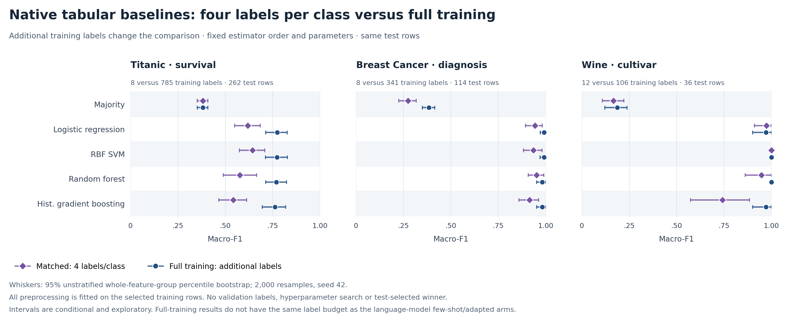

# Tabular benchmark findings

All **66 planned conditions are measured**, covering Titanic3, Breast Cancer Wisconsin Diagnostic and Wine with 9,064 predictions, four retained transport failures, six trained adapters and 48 paired contrasts. The [full report](TABULAR_COMPARISON.md), [CSV](TABULAR_COMPARISON.csv) and [JSON](TABULAR_COMPARISON.json) contain all model scores, macro-F1, probability metrics, grouped uncertainty, provenance and execution details.

## Accuracy at the same training-label budget

Few-shot, LoRA/QLoRA and native classical fitting use exactly four examples per class: eight labels for each binary task and twelve for Wine. Zero-shot uses no new labels. Classical preprocessing is fit on those selected rows only. No development labels or test-guided retuning are used.

| Model / method | Titanic (262 rows) | Breast Cancer (114 rows) | Wine (36 rows) |
|---|---:|---:|---:|
| Jev 1.13 zero-shot | 77.1% | 84.2% | 33.3% |
| Jev 1.13 few-shot | 74.4% | 93.0% | 91.7% |
| Qwen2.5 0.5B zero-shot | 61.8% | 37.7% | 33.3% |
| Qwen2.5 0.5B few-shot | 60.3% | 61.4% | 33.3% |
| Qwen2.5 0.5B LoRA | 61.8% | 62.3% | 33.3% |
| Qwen3 4B zero-shot | 64.5% | 61.4% | 38.9% |
| Qwen3 4B few-shot | 53.8% | 86.0% | 80.6% |
| Qwen3 4B QLoRA | 63.4% | 37.7% | 27.8% |
| GPT-5.6 Luna zero-shot | 76.7% | 75.4% | 47.2% |
| GPT-5.6 Luna few-shot | 81.3% | 91.2% | 88.9% |
| GPT-6 Astra zero-shot | 82.8% | 99.1% | 100.0% |
| GPT-6 Astra few-shot | 85.9% | 98.2% | 97.2% |
| Native majority, 4/class | 61.8% | 37.7% | 33.3% |
| Native logistic regression, 4/class | 64.1% | 94.7% | 97.2% |
| Native RBF SVM, 4/class | 70.2% | 93.9% | 100.0% |
| Native random forest, 4/class | 58.0% | 95.6% | 94.4% |
| Native histogram gradient boosting, 4/class | 56.5% | 92.1% | 77.8% |

These are observed percentages, not a ranking across future data. Wine's 36 rows make each error worth 2.78 percentage points. Its perfect observed scores and degenerate empirical bootstrap intervals do not imply perfect population accuracy.

## What the comparisons support

**Jev benefits from examples on Breast Cancer and Wine.** Its paired macro-F1 change from zero-shot is +0.0838 (95% interval [0.0067, 0.1623]) on Breast Cancer and +0.7497 [0.6318, 0.8440] on Wine. Titanic's observed change is −0.0285 [−0.0870, 0.0348], which does not clearly establish a benefit or harm from this example selection.

**Astra few-shot is ahead of Jev few-shot on Titanic and Breast Cancer in this experiment.** Jev-minus-Astra macro-F1 is −0.1103 [−0.1623, −0.0586] on Titanic and −0.0525 [−0.0975, −0.0175] on Breast Cancer. Wine's −0.0713 interval [−0.1856, 0.0187] includes zero. All intervals are exploratory and unadjusted for multiple comparisons.

**Jev few-shot exceeds the 4B few-shot model on Titanic and Breast Cancer by macro-F1**, with paired differences +0.2051 [0.1079, 0.3116] and +0.0706 [0.0062, 0.1415]. Wine's difference +0.1076 [−0.0113, 0.2485] is less conclusive. The Breast Cancer accuracy-difference interval touches zero, so this finding should be described specifically in terms of macro-F1.

**Classical ML is competitive with very few numerical training rows.** Matched logistic regression reaches 94.7% Breast Cancer and 97.2% Wine accuracy; RBF SVM gets all 36 Wine rows correct. Jev-minus-logistic-regression macro-F1 intervals include zero on both datasets. On Titanic, Jev few-shot exceeds matched logistic regression and random forest, with macro-F1 intervals [0.0418, 0.1906] and [0.0653, 0.2606]. The full report retains all five predeclared classical estimators rather than selecting one using test scores.

**This fixed QLoRA recipe is unreliable with eight or twelve labels.** Qwen3 4B QLoRA-minus-few-shot macro-F1 is −0.5842 [−0.6478, −0.5190] on Breast Cancer and −0.6639 [−0.7716, −0.5232] on Wine. Titanic's +0.1028 interval [−0.0407, 0.2505] includes zero. The 0.5B model is weak overall and gains little from this adapter recipe. These results concern one fixed final checkpoint, three epochs, rank eight and one training selection; they do not show that LoRA generally fails on tabular data. All six adapters are released without choosing checkpoints on the test set.

## Additional-label classical references

The full native training arms use 785 Titanic, 341 Breast Cancer and 106 Wine labels. Logistic regression accuracy is 79.0%, 99.1% and 97.2%; RBF SVM reaches 79.4%, 99.1% and 100.0%. These use more labels than the prompted/adapted arms. All preprocessing is fit on training rows, and all hyperparameters remain fixed.

## Reproducibility and limitations

Each LLM receives the same named `feature=value` serialization, with exact numerical round-tripping, quoted categories and explicit `NA` values. Native models receive the corresponding original features. Titanic uses seven pre-outcome features from the 1,309-row Titanic3 source; it is not the 891-row Kaggle training set. Target-derived fields and passenger identifiers are excluded. Identical serialized feature groups stay in one split; all their test rows are resampled together for 2,000 bootstrap replicates. The 262 Titanic test rows comprise 218 such groups. See the [protocol](../docs/TABULAR_PROTOCOL.md) for source hashes and split construction.

The split, demonstration selection, serialization and adaptation recipe use one fixed seed. Group bootstrap measures conditional held-out uncertainty, not variability across training selections or prompts. Familiar public data may have appeared during model pretraining. Wine labels are arbitrary cultivar IDs, so Astra's perfect zero-shot result cannot by itself establish unseen-data generalization or prove memorization. Proprietary models and Jev have no LoRA arm; only the two open models can be adapted here.

Open Qwen models score numeric class-ID-plus-EOS likelihoods, OpenAI generates labels, and Jev returns native Choice distributions. Probability coverage and calibration metrics reflect those different interfaces. Three Jev transport failures and one Astra timeout count as incorrect; probability metrics use only valid available distributions. Local and remote timing runs overlap and use different hardware, so their recorded timings are not a controlled speed comparison.

Colab's nine evaluations and three adapters passed [strict import verification](tabular/COLAB_IMPORT.json), with identical source/data identities and preserved original records. Local verification passes 300 tests with one skipped. The [release](https://github.com/statsguysam/jev-classification-benchmark/releases/tag/v0.3.0-tabular) includes six licensed adapter checkpoints, source/prepared data, notebook, transfer helper and measured results with SHA-256 manifests.

## API accounting

All 2,472 hosted requests reconcile with the shared ledger: 1,647 settlements, 825 retained reservations, no unresolved outcomes and no missing prediction records. Conservative tabular accounting is **US$13.229108700**; adding the frozen text study gives **US$18.522115700**, within the cumulative US$20 authorization.

Known tabular Jev API-reported costs total US$0.048789090 for 821/824 calls; three failed-call costs are unknown. OpenAI standard-rate token estimates total US$0.157638400 for all Luna calls and US$8.745930000 for 823/824 Astra calls; one timeout cost is unknown. Conservative ledger totals retain those uncertainties and are not invoices. See the [complete reconciliation](TABULAR_API_COST_SUMMARY.md).
