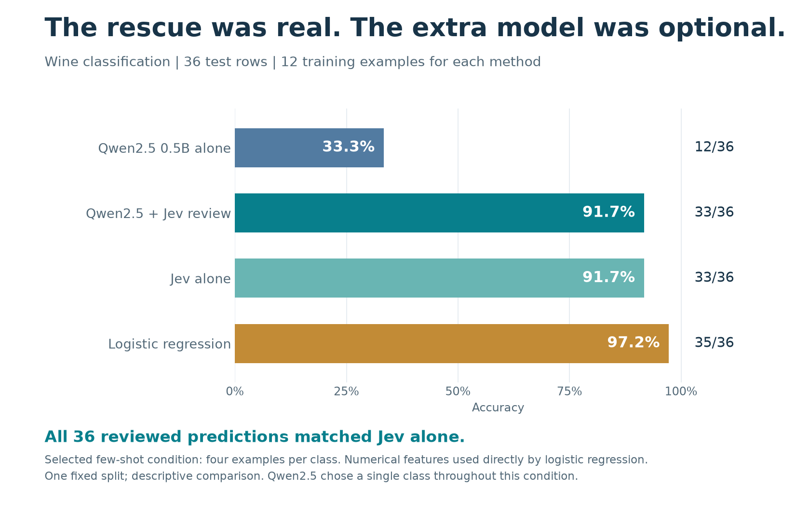
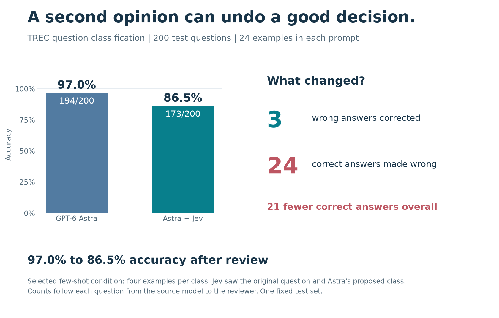
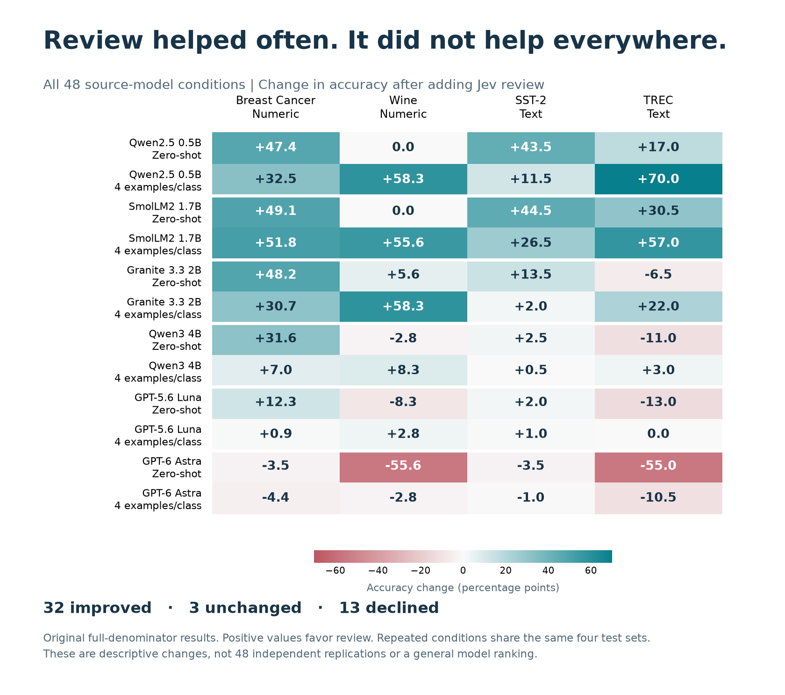
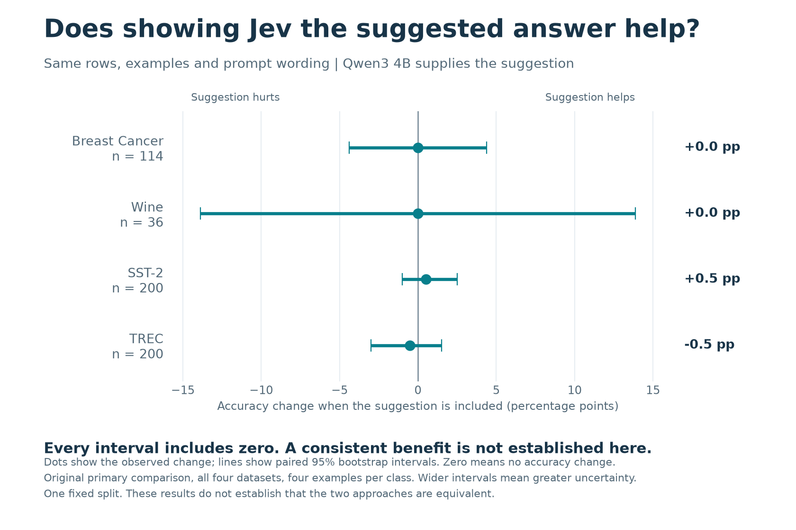
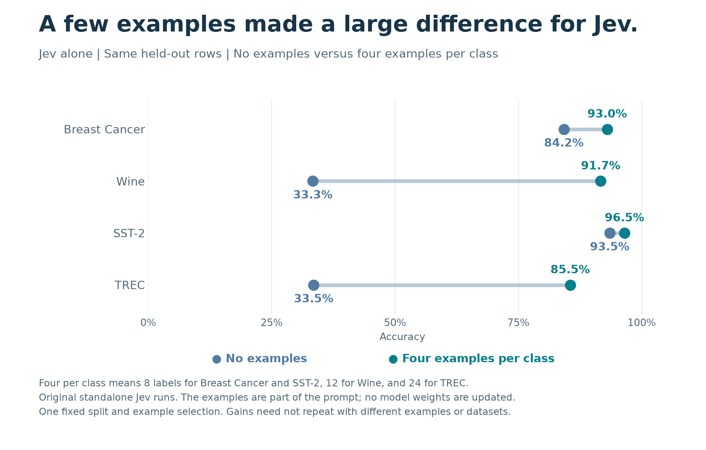
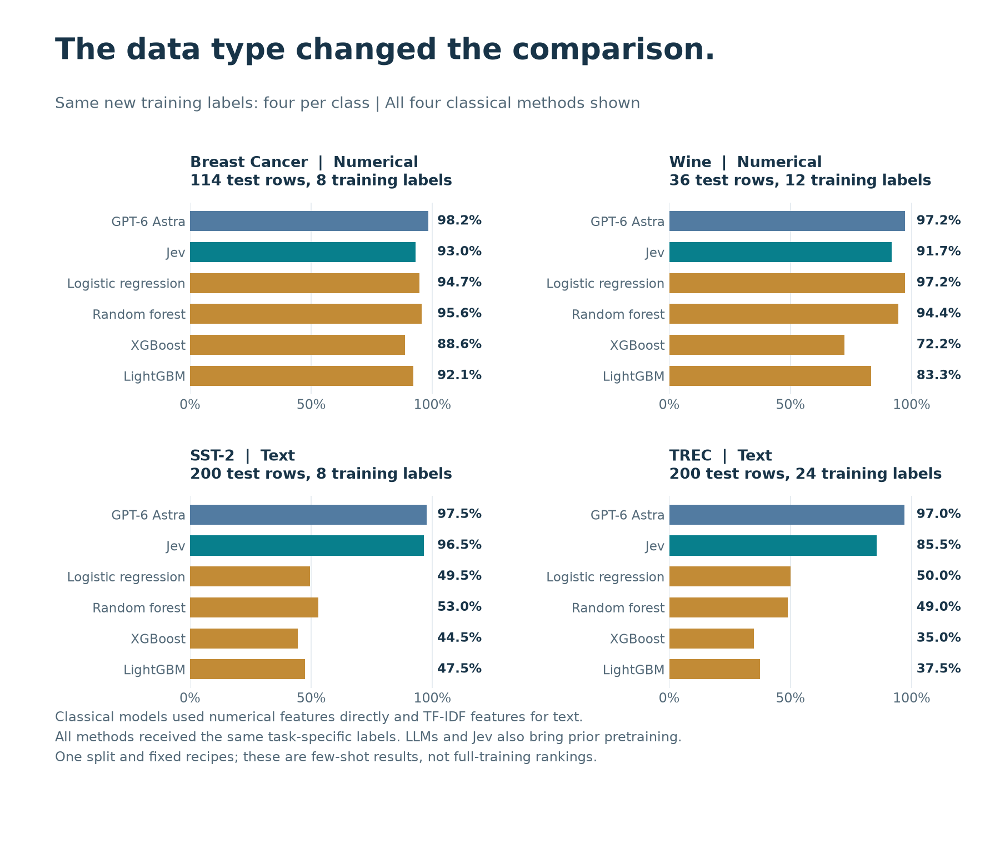
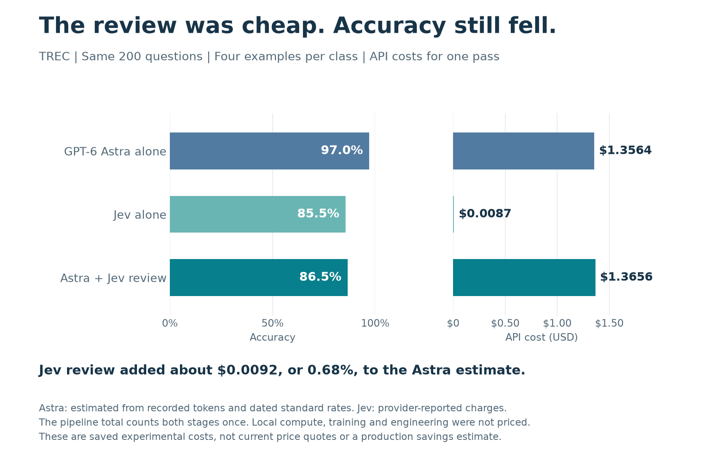

# What Happened When I Added Jev to a Classification Pipeline

*Six LLMs, four datasets, and a closer look at what a second model actually contributes.*

I tested Jev to understand where it helps and where a simpler classifier is enough.

The question was practical. If a task only needs a yes/no answer or one category from a fixed list, what should we use? A language model? A model built for bounded decisions? A conventional classifier trained on examples?

And if we already have an LLM, does putting Jev after it improve the final answer?

I wanted to start with numerical data. We routinely use logistic regression, random forests and boosted trees for those problems. If a new approach is useful there, it should be compared with those alternatives on the same rows.

The experiment later grew to include sentiment and question classification. That turned out to be useful, because the numerical and text results told rather different stories.

One result looked especially promising: a small Qwen model went from 33.3% accuracy to 91.7% after Jev reviewed its answers. But the next comparison changed what that improvement meant.

## First, what does “LLM plus Jev” mean?

TypeSafe describes Jev as a model for structured decisions. You provide the information to evaluate and define the question. Its Choice interface returns an option from your declared categories, together with probabilities. [TypeSafe’s overview](https://docs.typesafe.ai/concepts/system-one) and [Choice documentation](https://docs.typesafe.ai/primitives/choice) explain that interface.

In this experiment, Jev was a separate model. It was not a setting that changed Qwen or GPT’s decoding.

The reviewed route worked like this:

**Input row → LLM proposes a class → Jev sees the row and proposed class → final class**

Jev received the original input, the same labeled examples, and the LLM’s proposed class ID. It could keep that answer or choose another allowed class. It did not receive the source model’s name, explanation or confidence score.

That last detail matters. This tests whether a proposed label helps Jev make a decision. It does not test whether a carefully written explanation, additional evidence or a conversation between the models would help.

I compared four routes:

- The LLM alone.
- Jev alone.
- The LLM’s proposed class reviewed by Jev.
- A classical classifier trained on the task.

A category can be valid and still be wrong. Defining the allowed answers makes the interface useful, but accuracy still has to be measured against the true labels.

## Giving the comparison a fair starting point

The six source LLMs were Qwen2.5 0.5B, Qwen3 4B, SmolLM2 1.7B and IBM Granite 3.3 2B, plus OpenAI’s GPT-5.6 Luna and GPT-6 Astra. The reviewer was TypeSafe’s Jev 1.13, accessed through OpenRouter’s native TypeSafe route.

The classical models were logistic regression, random forest, XGBoost and LightGBM.

I used four datasets:

- **Breast Cancer Wisconsin Diagnostic:** numerical features, two classes, 114 test rows.
- **Wine:** numerical features, three classes, 36 test rows.
- **SST-2:** text sentiment, two classes, 200 test examples.
- **TREC:** text question classification, six classes, 200 test examples.

That gives 550 distinct test examples. Each method saw the same test examples within its dataset. Running more methods did not create more independent test data.

For the LLMs and Jev, zero-shot meant no labeled task examples in the prompt. Few-shot meant four examples **per class**: eight for each binary task, twelve for Wine and twenty-four for TREC.

For classical ML, I kept two comparisons separate. One trained each model on exactly the same selected examples used in the few-shot prompts. The other used all of the prepared training data: 341 Breast Cancer rows, 106 Wine rows, 10,000 SST-2 examples and 4,886 TREC examples. The SST-2 preparation was capped, so “full prepared training” does not mean the entire original dataset.

This matches the number of new task labels in the first comparison. It cannot match the knowledge that a pretrained model acquired before the experiment.

### How a numerical row became an LLM input

The numerical datasets stayed numerical tasks. I serialized their measurements into a fixed list of named values so that the language models and Jev could read them.

An abbreviated, illustrative Wine input looks like this:

`alcohol=13.2; malic_acid=1.8; ash=2.4; ...`

The actual input contained all thirteen Wine measurements, or all thirty Breast Cancer measurements, in a fixed order. Values retained their source scales. No target label or row identifier was included in the input.

The classical models received the corresponding native numerical columns. For text, the classical models used word and character TF-IDF features fitted only on their training examples.

I used fixed recipes rather than tuning each method until it looked good on the test set. That makes the comparison inspectable, but it also means these are not the best possible scores for every model.

## The Wine result looked like a reason to add a reviewer

With four examples per class, Qwen2.5 0.5B classified 12 of the 36 Wine rows correctly. After Jev review, the pipeline classified 33 correctly.

That is a gain of 21 decisions, or 58.3 percentage points.

If I had stopped there, the natural conclusion would have been that the two-model pipeline was a big improvement. Relative to that source model, it was.

Then I checked Jev alone.

It also got 33 out of 36 right. More importantly, **every one of its 36 final labels matched the reviewed pipeline**.

*All four methods were evaluated on the same 36 Wine rows. Jev alone and the reviewed pipeline produced identical labels in this condition.*

The first model had predicted one class throughout this test run. Jev substantially improved that output, but the chain showed no additional accuracy over asking Jev directly.

There was another useful reference in the same experiment: logistic regression trained on the same twelve examples got 35 of the 36 rows right, or 97.2%.

The lesson was quite specific. A reviewer can rescue a weak source without demonstrating that the source is worth keeping in the pipeline. And on this numerical dataset, a small trained classifier remained a serious alternative.

Wine is a small test. One changed answer moves accuracy by 2.8 percentage points. These numbers are a reason to investigate, not a reason to declare a universal winner.

## On TREC, the extra opinion made the answer worse

The TREC result challenged the other side of the idea.

With four examples per class, GPT-6 Astra correctly classified 194 of 200 questions: 97.0% accuracy.

After Jev reviewed those proposed classes, the final result was 173 out of 200: 86.5%.

Looking at the individual decisions made the change easy to understand. Jev corrected three mistakes. It also changed twenty-four correct answers into wrong ones.

The arithmetic is simple: 194 + 3 − 24 = 173.

*The reviewer needs to preserve good decisions as well as correct bad ones. Here, harmful overrides outnumbered corrections eight to one.*

Calling a second model does not automatically give us a better final judgment. A source that already gets most cases right leaves relatively few mistakes to fix, while every correct answer is another opportunity for an unnecessary override.

This was not the only direction in the results. In the original forty-eight source-to-Jev review comparisons, accuracy improved over the source in thirty-two, tied in three and declined in thirteen.

*All forty-eight review conditions are shown. Each cell compares the reviewed pipeline with its own source on the same test rows; the cells reuse four test sets and are not forty-eight independent replications.*

Those counts explain why a single “Jev helps” or “Jev hurts” verdict would miss the point. They also do not tell us whether the first model helped Jev. For that, the experiment needed another comparison.

## Was Jev using the proposed answer, or solving the task again?

The Wine result raised a question that accuracy alone could not settle.

I had compared a reviewed pipeline with Jev alone, but the two prompts were not identical. To examine the proposal itself, I ran a separate controlled comparison with Qwen3 4B and four examples per class.

I kept the input row, examples and Jev instructions fixed. Only the proposal slot changed:

- One version contained Qwen3’s actual suggested class.
- One contained no suggested class.
- One contained suggestions shuffled between test rows.

The shuffled version was a check on whether a suggestion needed to belong to that particular row. Shuffling does not guarantee a wrong class, because different rows can legitimately have the same label.

In the original controlled comparison, providing the real proposal produced the same accuracy as no proposal on Breast Cancer and Wine. It added one correct answer out of 200 on SST-2 and removed one correct answer out of 200 on TREC.

*Points show the measured accuracy difference; horizontal ranges show its uncertainty on these test examples. Every range includes zero, so this experiment does not establish a dependable gain from supplying the proposed class. The ranges do not include the effect of changing prompts, examples or dataset splits.*

I would read this as a reason to question the extra step in this implementation. I would not read it as proof that proposals never help. The experiment used one source model, one set of examples, one shuffle and a small collection of test cases. It also did not give Jev the source model’s reasoning or additional evidence.

I designed this follow-up after seeing the earlier results on these same test rows. It is an exploratory check, not an independent confirmation on fresh data.

The controlled no-proposal prompt is its own comparison. Its scores should not be substituted for the earlier standalone Jev scores, which came from a different prompt.

## Examples mattered, but not equally everywhere

The zero-shot and few-shot results were worth looking at separately.

For Jev alone, four examples per class changed accuracy from 84.2% to 93.0% on Breast Cancer, 33.3% to 91.7% on Wine, 93.5% to 96.5% on SST-2, and 33.5% to 85.5% on TREC.

*The same test rows are used within each dataset. Few-shot supplies four labeled examples per class, not four examples in total.*

Sentiment was already a strong zero-shot result. Wine and TREC changed much more after examples were supplied.

Wine needs a little care here. Its class IDs are arbitrary cultivar categories. Without examples, a model has little basis for knowing which collection of measurements the benchmark calls class 0, 1 or 2. Examples help establish that mapping. The increase should not be interpreted as a general measure of zero-shot numerical reasoning.

The practical lesson is to test the label definitions and examples that your application will actually supply. “Zero-shot” and “few-shot” describe different amounts of task information, and neither is a single model capability that transfers unchanged to every dataset.

## Numerical data and text led to different classical baselines

This was the part of the experiment I most wanted to preserve in the story.

On the numerical tasks, conventional classifiers learned something useful from very few labels. With eight training examples, random forest reached 109 out of 114 on Breast Cancer, or 95.6%. On Wine, logistic regression reached 35 out of 36 with twelve examples.

The text tasks looked different. With eight SST-2 training examples, the four classical models ranged from 44.5% to 53.0%. With twenty-four TREC examples, they ranged from 35.0% to 50.0%.

*All displayed methods receive the same new task-specific labels within each dataset. Pretraining exposure is not equalized. These are fixed recipes, not tuned best-case scores.*

A TF-IDF classifier trained on eight examples has to learn useful vocabulary from those eight examples. A pretrained language model arrives with a large amount of language knowledge already available. Matching the prompt examples and training examples does not remove that difference.

Additional labels also changed the classical reference. TREC logistic regression reached 86.5% using all 4,886 prepared training examples, compared with 50.0% using twenty-four. SST-2 logistic regression rose from 49.5% with eight examples to 79.0% with 10,000. Those are useful supervised alternatives, but they belong to a different label budget.

On these two numerical datasets, a small trained model was already competitive. On these two text datasets, Jev had a much stronger starting point than the classical models trained on the small matched example sets. I would want more datasets before turning that observed pattern into a general rule.

## The cost comparison was more interesting than “two calls cost more”

For the same 200 few-shot TREC questions, the three routes looked like this:

- **Jev alone:** 85.5% accuracy, about **$0.009** in API charges.
- **Astra alone:** 97.0% accuracy, about **$1.36** in estimated API cost.
- **Astra followed by Jev:** 86.5% accuracy, about **$1.37** for both stages.

*Jev costs are provider-reported. Astra costs are estimates from recorded token usage and the rates recorded for the experiment. The pipeline total includes one source pass and one review pass.*

The additional review charge was under one cent for these 200 questions. Relative to the source estimate, it added about 0.68%.

So the interesting issue here was not a large extra API bill. It was the loss in decision quality. The extra stage was cheap, but it made this particular pipeline less accurate.

Jev alone also represented a real tradeoff: much lower API cost than Astra, alongside lower accuracy on these questions. Whether that is attractive depends on what a wrong decision costs in the application.

These figures come from saved usage records. OpenAI costs use the September 22, 2026 standard rates recorded for the run, without assuming a cache discount. Jev values are OpenRouter-reported charges. During the experiment I reused the source predictions, so the two-stage total reconstructs the cost of running both stages once; it is not all new spending from the review phase.

Local compute, classical-model training and inference, and engineering time were not priced. I therefore cannot turn these API costs into a production total-cost comparison. I also did not establish a controlled speed ranking across hosted APIs, local models and classical batch inference.

## What I would carry into the next experiment

I would start with the best practical single-model baseline available for the task. Then I would ask a proposed reviewer to justify its place on examples that neither development nor prompt selection had already used.

I would measure how often it corrects the source, how often it overturns a correct answer, and whether the combination improves on the reviewer alone. Cost and latency would sit beside those comparisons.

Confidence needs a separate check as well. A model returning probabilities does not establish that those probabilities are reliable on new application data. Before using a score to decide which cases deserve review, I would check how it relates to observed correctness on representative labeled examples.

The next useful steps are straightforward: less familiar numerical datasets, more train/test splits, different example selections, and prompts that carry additional evidence rather than only a proposed class. A study of selective review would also need to choose its routing rule on development data before evaluating it on untouched test cases.

There are limits to what this pilot can settle. Each dataset used one fixed train/test split and one selected set of few-shot examples. Wine had only thirty-six test rows. All four datasets are public and may have appeared in pretraining. Several small models repeatedly chose one class under the prompts and scoring used here. For local LLMs, I selected among allowed numeric class IDs using their likelihoods, including an end-of-sequence token; a different prompting or generation method could behave differently.

The focused comparison covers zero-shot and few-shot inference. Earlier LoRA work is separate and is not evidence for the reviewer conclusions in this article. The numerical Breast Cancer task is a benchmark exercise, not a clinical validation.

I came away with a more useful question than which model won a small leaderboard. A reviewer can substantially improve a weak source, yet add nothing over its own standalone decision. It can also undo correct answers from a strong source. Both are easy to miss if we only compare the pipeline with the first model.

**When does adding Jev as a reviewer improve the final decision enough to justify the extra step?**

That is the question I would test before adding it to a real workflow.

### Data and further reading

The numerical datasets are Breast Cancer Wisconsin Diagnostic, by Wolberg, Mangasarian, Street and Street, and Wine, by Aeberhard and Forina. Both are distributed by UCI under CC BY 4.0; the experiment used their scikit-learn copies with fixed splits and named-feature serialization. Text data came from SST-2 and TREC, with the prepared test subsets described above.

- [UCI Breast Cancer Wisconsin Diagnostic](https://archive.ics.uci.edu/dataset/17/breast+cancer+wisconsin+diagnostic)
- [UCI Wine](https://archive.ics.uci.edu/dataset/109/wine)
- [Stanford Sentiment Treebank](https://nlp.stanford.edu/sentiment/)
- [CogComp question classification data](https://cogcomp.seas.upenn.edu/Data/QA/QC/)
- [TypeSafe Choice documentation](https://docs.typesafe.ai/primitives/choice)
- [OpenRouter’s TypeSafe integration](https://openrouter.ai/docs/guides/community/typesafe-sdk)

The figures were generated from the saved benchmark results. This is an exploratory study of one implementation, not a claim of a new architecture or a general ranking of model families.
