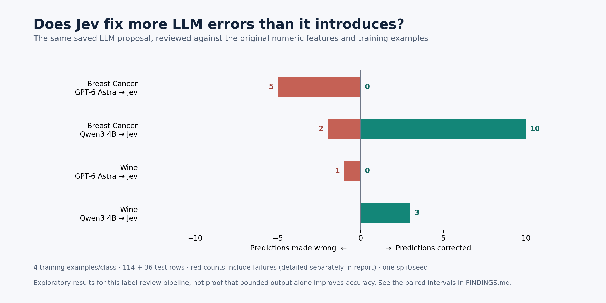
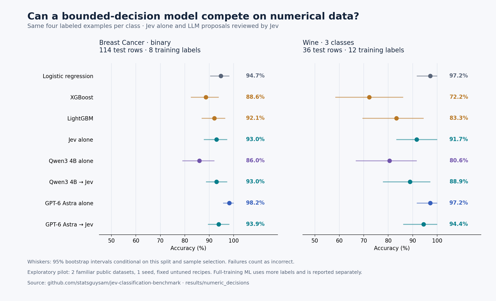

# What this numerical pilot teaches us about Jev

**Jev review improved the smaller LLM's measured accuracy and reduced the frontier model's measured accuracy on both datasets. The review did not establish an advantage over using Jev directly. Classical ML remained a strong alternative.**

This answers a narrower, concrete question than the earlier dashboard: what happens when Jev reviews an LLM's proposed class on numerical tabular rows? It does not claim that Jev is a decoding wrapper or that a bounded output must be correct.

## How the system works

[TypeSafe describes Jev](https://docs.typesafe.ai/concepts/system-one) as a separate decision model. It receives a state and typed questions. In our experiment, the question is a Choice with exactly two or three allowed categories. A numerical row is serialized into named feature values; Jev returns one allowed class and a probability distribution. That distribution must still be evaluated against the true outcomes.

The new composition is:

```text
Numeric row + the same labeled examples
         ├── LLM → proposed class ────────────┐
         └── original row and examples ──────┤
                                            ▼
                                      Jev Choice
                                            ▼
                                     final class
```

We reuse the exact saved Qwen3 4B and GPT-6 Astra proposals, so this experiment needs no new LLM-generation calls. Jev does not see the true test label, the source model's name, or an invented explanation. This is a **class-proposal review**, not an experiment with LLM-generated reasoning. Native XGBoost and LightGBM receive the corresponding numeric columns and already produce bounded classes themselves.

## The measured changes

All four comparisons use the same four training examples per class and the same held-out rows.

| LLM → Jev | Breast Cancer, 114 test rows | Wine, 36 test rows |
|---|---:|---:|
| Qwen3 4B alone → reviewed | 86.0% → **93.0%** | 80.6% → **88.9%** |
| GPT-6 Astra alone → reviewed | 98.2% → **93.9%** | 97.2% → **94.4%** |

On Breast Cancer, Jev corrected **10** Qwen errors and introduced **2** wrong labels. For Astra, it corrected **0**, introduced **4** wrong labels, and had **1** transport failure on a formerly correct row. That failure stays in the accuracy denominator. On Wine, it corrected three Qwen errors and introduced none; it introduced one Astra label error and retained one pre-existing failed source proposal without making a review call for that row.

The Breast Cancer accuracy changes have paired 95% bootstrap intervals of **+7.02 pp [1.75, 13.16]** for Qwen and **−4.39 pp [−8.77, −0.88]** for Astra. Wine's intervals touch zero: **+8.33 pp [0, 19.44]** and **−2.78 pp [−8.33, 0]**. These are exploratory, unadjusted intervals conditional on one split and training-example selection.



## Is the LLM stage needed?

Jev alone achieved **93.0% / 91.7%** on Breast Cancer / Wine. The Qwen → Jev chain achieved **93.0% / 88.9%**. In these measurements, starting with Qwen did not improve on Jev's direct accuracy. Astra → Jev was slightly above Jev alone, but the paired intervals do not establish an advantage.

The useful architecture lesson is to test the components as well as the chain. Improving a weak first-stage model does not show that both stages are necessary. In a live application, the chain also pays for and waits for the first LLM call, even though this experiment reused cached proposals.

## Comparison with classical ML

| System | Training labels | Breast Cancer accuracy | Wine accuracy |
|---|---|---:|---:|
| Jev alone, few-shot | 8 / 12 | 93.0% | 91.7% |
| XGBoost | Same 8 / 12 | 88.6% | 72.2% |
| LightGBM | Same 8 / 12 | 92.1% | 83.3% |
| Logistic regression | Same 8 / 12 | **94.7%** | **97.2%** |
| XGBoost | Full 341 / 106 | 97.4% | 94.4% |
| LightGBM | Full 341 / 106 | 96.5% | 94.4% |

Jev's point estimates exceeded the two fixed boosting recipes with very few supplied labels. That is not a general win over classical ML: logistic regression and random forest had higher point estimates than Jev under the same small label budget. When more training labels were available, both boosting models also exceeded Jev's few-shot accuracy. Full-training results use additional labels and answer a different practical question.

Most Jev-versus-boosting paired intervals cross zero. The largest separation was against XGBoost on the tiny Wine split, a setting where XGBoost had only 12 training rows. No baseline was tuned on test outcomes; these are modest fixed recipes, not optimized leaderboard scores.



## A defensible conclusion to share

**A bounded decision layer is not an automatic accuracy upgrade. In this small numerical pilot, Jev helped the weaker LLM, hurt the stronger one, and classical ML remained competitive. The results depended on the component models and the training-label budget; adding a second stage did not consistently improve accuracy.**

Treat that as a measured observation and a reason for further testing. Two familiar datasets, one split, one seed, and 36 Wine test rows cannot establish general superiority or novelty across the field. Pretraining exposure, representation changes, different demonstrations and tuned baselines could change the outcome. This is a benchmark exercise, not clinical validation.

All 299 new Jev calls reconcile: known reported charges were **US$0.047467518 for 298 calls**, with **one unknown charge**. Conservative reservations keep cumulative study accounting at **US$19.325827700**, within the approved US$20 ceiling. A live chain's total cost also includes the original LLM calls. See [cost reconciliation](COSTS.json).

See [full metrics and paired intervals](FINDINGS.md), [raw numerical comparison](COMPARISON.json), [protocol](../../docs/NUMERIC_DECISIONS_PROTOCOL.md), and [LinkedIn draft](LINKEDIN_DRAFT.md).
